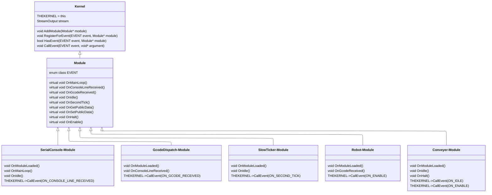

# ProjectAxisSystem
## Implementation of the Event/Module System from Smoothieware.

### Overview

This is my implementation of the module system that is part of the application design of
Smoothieware (https://github.com/VandalForge/Smoothieware), the operating system
designed for use in CNC machines written in C++ by The Smoothie Project. 

### Architecture



### Directory Structure

```
```

---

### Design

This module/event system design is heavily inspired by the Smoothieware v1.0
firmware developed by The Smoothie Project for CNC machines. My goal was simply 
to implement the system as a vehicle for learning as I thought the design was 
quite clever when I previously worked on the project in college.

I implemented the architecture in similar way using more modern C++ features
(smart pointers, enum classes, etc.) than is found in the Smoothieware source 
code. I also separated the user/machine-specific code from the core code (the
"Axis Engine"), which in theory should make local development for a specific 
CNC machine straight forward.

I have future plans to incorporate the movement control flow to this and make a
TUI CNC Machine simulator of sorts.

[//]: # (TODO: Add more narrative about the kernel and functions.)
[//]: # (TODO: Add more narrative about the core modules and functions.)

### Custom Modules

[//]: # (TODO: Add the instructions for adding custom modules.)
[//]: # (TODO: Add the instructions for the shape of main.)

## Build

This project uses CMake to generate the build files.

### 1. Clone the repository to your desired project directory.

```bash
# from the desired parent directory

git clone https://github.com/BocanOnline/ProjectAxisEngine

```

### 3. Build the project.

This project includes helper scripts to build, run, test, and clean the project. 
These scripts can all be ran from the project root. These scripts require CMake 
to be installed as well as your build system of choice (e.g. Make, Ninja, etc.).

```bash
# setup the scripts as executables, you only need to do this once

chmod +x ./scripts/build-clean.sh \
./scripts/build-debug.sh \
./scripts/build-release.sh \
./scripts/build-test.sh \
./scripts/build-run-debug.sh \
./scripts/build-run-release.sh
```

```bash
# run each script from the project directory

./scripts/clean.sh              # clean all artifacts and delete build directories 
./scripts/build-debug.sh        # build the debug configuration to build-debug/ 
./scripts/build-release.sh      # build the release configuration to build-release/
./scripts/run-test.sh           # run all registered tests with ctest 
./scripts/run-debug.sh          # run the debug binary 
./scripts/run-release.sh        # run the release binary
```

[//]: # (### 4. Developing.)
[//]: # (## Adding Modules to the Library.)
[//]: # (## Adding Third-Party Libraries.)
[//]: # (## Adding Application-Specific Code.)
[//]: # (### 5. Testing.)
[//]: # (## Registering New Tests.)
[//]: # (### 6. Building.)
[//]: # (## Adding New Binaries -Libraries or Executables-.)
[//]: # (## Adding New Build Configurations.)

---

## Documentation

README.md

[//]: # ([CONTRIBUTING.md](/CONTRIBUTING.md))

[//]: # (TODO: Add link to docs/ root to documentation tree.)


### License

This project is published under The Unlicense. 
The code is public domain; use it however you want. 

Full text in [LICENSE.md](/LICENSE.md)
